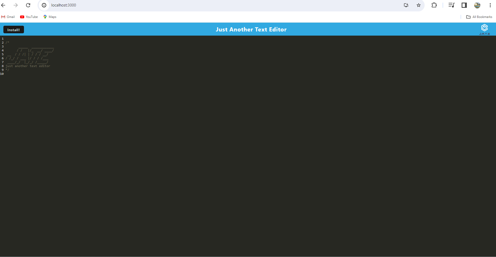
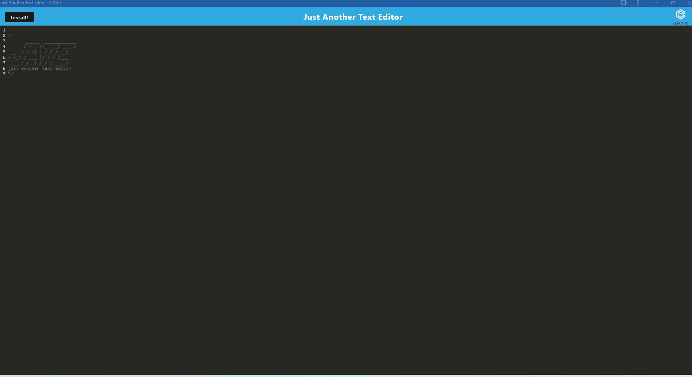
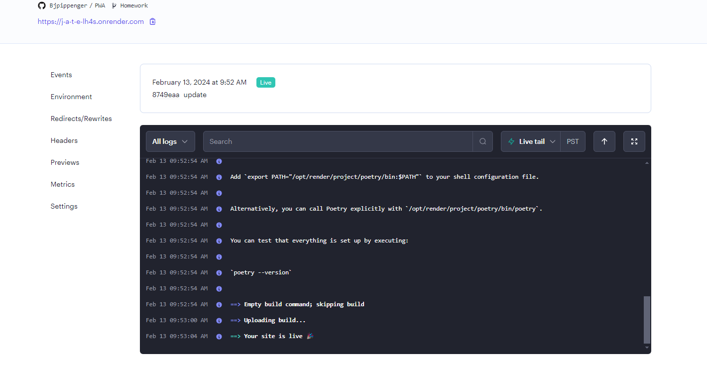

# Table of Contents
- [Project Name](#project-name)
- [Description](#description)
- [Installation](#installation)
- [Usage](#usage)
- [Features](#features)
- [Contributing](#contributing)
- [License](#license)
- [Tests](#tests)
- [Questions](#questions)
- [Screenshots](#screenshots)
## Project Name
${PWA}
## Description
${description}
Text editor application
## Installation
${installation}
Download git repository, ensure you have proper dependencies as followed.
npm run build 
npm run start dev
## Usage
${usage}
a text editor that runs in the browser 
## Features
${features}
edit text and save pwa
## Contributing
${contributing}

## License
[Mit License](https://choosealicense.com/licenses/mit/#)
## Tests
${tests}
## Questions
- [bjpippenger](https://github.com/Bjpippenger/PWA)
- [send-email-to](bjpippenger@yahoo.com)
- [recording-of-working-application]()
## Screenshots
${screenshots}

Choose a LicenseChoose a License
MIT License
A short and simple permissive license with conditions only requiring preservation of copyright and license notices. Licensed works, modifications, and larger works may be distributed under different terms and without source code.